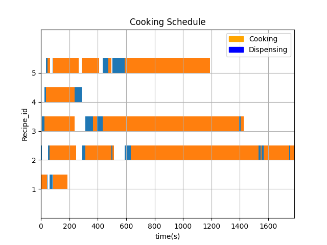

# How To Compile The Code
```mkdir build``` <br />
```cd build``` <br />
```cmake ..``` <br />
```make```

# How To Run the Scheduler 
Follow the steps above to compile and then from the build directory, run ```./createSchedule arg1, ..., arg5```, where arg1 to arg5 are the names of the recipes in the order. For example, you might run ```./createSchedule asparagus_soup carrot_soup chili_con_carne chocolate_ice_cream mushroom_risotto```. This will create a schedule and write it to a csv file. To then create the gant chart, run ```cd ../src``` and then ```python3 plotSchedule.py```. The schedule is written to src/schedule.png. To view it, run vlc ```schedule.png```. To view all available recipes, run ```./createSchedule help```. This will show you a list of available recipes.

# Toy Dataset
I created a set of text files that describe recipes. The text files are at allRecipes/<recipe_name>

# Approach
I thought a lot about how to compute the optimal schedule. The problem is similiar to many other well studied scheduling problems like the flow shop and job shop problems. I could not quite reduce this problem to one of these though. To find the optimal solution seems to require either dynamic programming or searching through all the permutations of possible orderings. I could not find a good dynamic programming approach and calculated that an explicit search through the space would not be practical. So, I opted for a greedy policy based on a simple heuristic. I then wrote my code as generally as possible in order to facilitate changing the heuristic if I wanted to. Changing the heuristic requires only editing one function. <br />

My heurestic is for scheduling which recipe gets to use the dispenser at a given point in time. If more than one recipe needs the dispenser at a given point in time, the heurestic chooses which process gets to use it. The recipe with the next shortest recipe step is chosen. We want to minimize the total number of time slices where recipes are not accomplishing useful work. By giving priority to the recipe with a shorter time spent using the dispenser, we minimize the amount of time that the set of competing recipes is not not doing useful work but only over a very short time horizion. There is no guarantee that the heurestic will lead you to the globally optimum solution. 


# Results 
Below is an example of the gant charts created by the scheduler. The blue sections indicate that the recipe is using the dispenser. The orange sections indicate that the recipe is cooking. The simple greedy policy performs pretty well. Since the cooking operations tend to be much longer than the dispensing operations, there are relatively few time slices where robots are idle. 
<br />  



# Unit Testing
I used gtest to create unit tests. test/runUnitTests has a set of tests for creating schedules. To run the tests, ```cd build``` <br />
```cmake ..``` <br />
```make``` <br />
```./runUnitTests```

# Dependencies
matplotlib, (```pip install matplotlib```) <br />
C++ 14 <br />
Python3 <br />
CMake <br />
